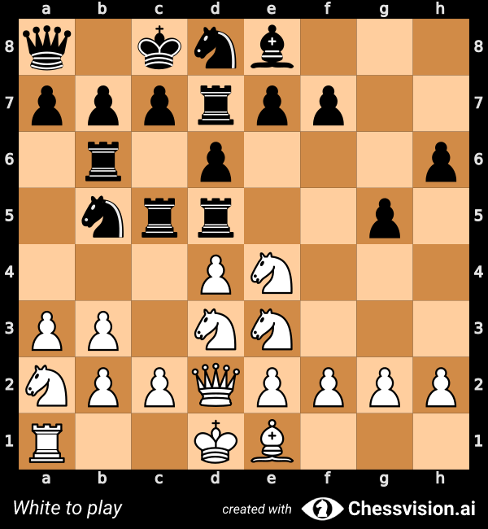

# Genetic Chess
## Balanced, asymmetrical chess position generation using genetic algorithms and Stockfish evaluation.


2nrk1br/pppbb1p1/3rp1np/3r1p2/7P/PPP1P3/2QPNPP1/1R1KBQ1B w - - 0 1


2r1nkq1/p2prqrb/1pp1p1p1/5p1p/1BNP4/2NPP2P/2PN1PP1/QBKB1R2 w - - 0 1


1rbk4/1rrbbpnp/1pppp3/4r1p1/4R3/2PQP1P1/PP1PRP1P/4KNRB w - - 0 1


q1knb3/ppprpp2/1r1p3p/1nrr2p1/3PN3/PP1NN3/NPPQPPPP/R2KB3 w - - 0 1

```
                                 |\_
O       o O       o O       o   /  .\_
| O   o | | O   o | | O   o |  |   ___)
| | O | | | | O | | | | O | |  |    \
| o   O | | o   O | | o   O |  |  =  |
o       O o       O o       O  /_____\
                              [_______]

Genetic Chess
By Santiago Benoit

Arguments: Namespace(stockfish='./stockfish', depth=20, final_depth=30, seed=None, odds=0.0, target_error=0.1)
Stockfish version: 15
Random seed: 2252179159

Evolving structure...

Evolving balance...

[Generation 0] [Evaluation 3.47] [FEN 2nrk1br/ppppb1p1/3rp1np/3r1p2/7P/PPP1P3/2QPNPP1/NR1KBQ2 w - - 0 1]
[Generation 1] [Evaluation 0.48] [FEN 2nrk1br/ppppb1p1/3rp1np/3r1p2/7P/PPP1P3/2QPNPP1/1R1KBQ2 w - - 0 1]
[Generation 2] [Evaluation 0.48] [FEN 2nrk1br/ppppb1p1/3rp1np/3r1p2/7P/PPP1P3/2QPNPP1/1R1KBQ2 w - - 0 1]
[Generation 3] [Evaluation -0.02] [FEN 2nrk1br/pppbb1p1/3rp1np/3r1p2/7P/PPP1P3/2QPNPP1/1R1KBQ1B w - - 0 1]

Final analysis...

RESULTS

+---+---+---+---+---+---+---+---+
|   |   | n | r | k |   | b | r | 8
+---+---+---+---+---+---+---+---+
| p | p | p | b | b |   | p |   | 7
+---+---+---+---+---+---+---+---+
|   |   |   | r | p |   | n | p | 6
+---+---+---+---+---+---+---+---+
|   |   |   | r |   | p |   |   | 5
+---+---+---+---+---+---+---+---+
|   |   |   |   |   |   |   | P | 4
+---+---+---+---+---+---+---+---+
| P | P | P |   | P |   |   |   | 3
+---+---+---+---+---+---+---+---+
|   |   | Q | P | N | P | P |   | 2
+---+---+---+---+---+---+---+---+
|   | R |   | K | B | Q |   | B | 1
+---+---+---+---+---+---+---+---+
  a   b   c   d   e   f   g   h

Evaluation: -1.08
FEN: 2nrk1br/pppbb1p1/3rp1np/3r1p2/7P/PPP1P3/2QPNPP1/1R1KBQ1B w - - 0 1
```

## Installation
1. Clone this repository
2. `pip install -r requirements.txt`
3. Download the latest Stockfish binary for your system: https://stockfishchess.org/download/

## Usage
```
python GeneticChess.py [-h] [--stockfish STOCKFISH] [--depth DEPTH] [--final-depth FINAL_DEPTH]
                       [--seed SEED] [--odds ODDS] [--error ERROR]

options:
  -h, --help            show this help message and exit
  --stockfish STOCKFISH
                        path to stockfish binary (default ./stockfish)
  --depth DEPTH         balance evaluation depth (default 20)
  --final-depth FINAL_DEPTH
                        final evaluation depth (default 30)
  --seed SEED           random seed (default random)
  --odds ODDS           target evaluation (default 0.0)
  --error ERROR
                        target error margin for evaluation (default 0.1)
```
