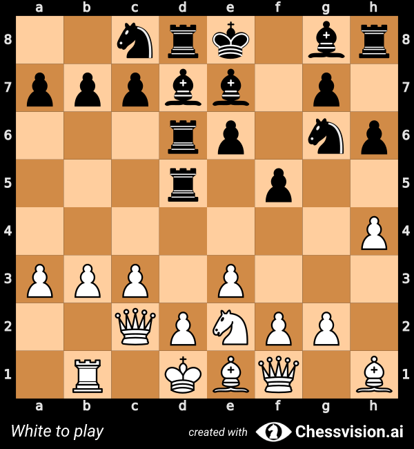
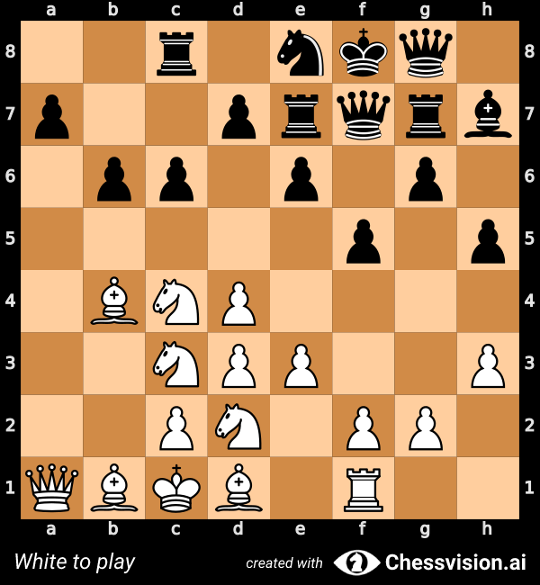
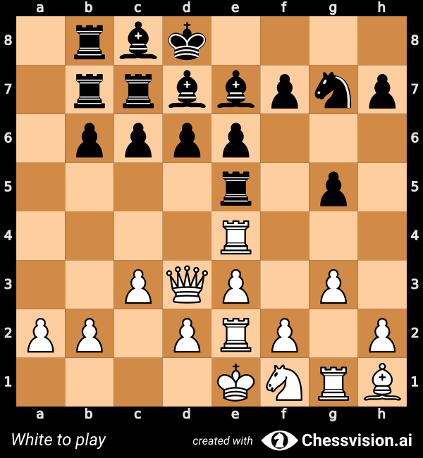

# Genetic Chess
## Balanced, asymmetrical chess position generation using genetic algorithms and Stockfish evaluation.


2nrk1br/pppbb1p1/3rp1np/3r1p2/7P/PPP1P3/2QPNPP1/1R1KBQ1B w - - 0 1




```
                                 |\_
O       o O       o O       o   /  .\_
| O   o | | O   o | | O   o |  |   ___)
| | O | | | | O | | | | O | |  |    \
| o   O | | o   O | | o   O |  |  =  |
o       O o       O o       O  /_____\
                              [_______]

Genetic Chess
By Santiago Benoit

Arguments: Namespace(stockfish='./stockfish', depth=20, final_depth=30, seed=None, odds=0.0, target_error=0.1)
Stockfish version: 15
Random seed: 2252179159

Evolving structure...
```
<details>
```
==========================================================
n_gen  |  n_eval  | n_nds  |      eps      |   indicator  
==========================================================
     1 |      100 |     22 |             - |             -
     2 |      200 |     35 |  0.2088191647 |         ideal
     3 |      300 |     55 |  0.1636363636 |         nadir
     4 |      400 |     48 |  0.0967062428 |         ideal
     5 |      500 |     32 |  0.0780247615 |         ideal
     6 |      600 |     45 |  0.0424345461 |         ideal
     7 |      700 |     57 |  0.0083376759 |         ideal
     8 |      800 |     59 |  0.0170467351 |         ideal
     9 |      900 |     43 |  0.0318099164 |         ideal
    10 |     1000 |     52 |  0.0476190476 |         ideal
    11 |     1100 |     50 |  0.0306262839 |             f
    12 |     1200 |     56 |  0.1052631579 |         nadir
    13 |     1300 |     65 |  0.0434782609 |         ideal
    14 |     1400 |     65 |  0.0374087263 |         ideal
    15 |     1500 |     68 |  0.0273972603 |         nadir
    16 |     1600 |     68 |  0.1578947368 |         nadir
    17 |     1700 |     78 |  0.0038697194 |         ideal
    18 |     1800 |     81 |  0.0476190476 |         nadir
    19 |     1900 |     88 |  0.4444444444 |         nadir
    20 |     2000 |     95 |  0.0210436240 |             f
    21 |     2100 |     95 |  0.0166666667 |         ideal
    22 |     2200 |     96 |  0.0526315789 |         ideal
    23 |     2300 |     88 |  0.0159645233 |         ideal
    24 |     2400 |     95 |  0.0126745506 |             f
    25 |     2500 |     95 |  0.0126450143 |             f
    26 |     2600 |     92 |  0.0132520528 |             f
    27 |     2700 |     77 |  0.0137418556 |             f
    28 |     2800 |     73 |  0.0476190476 |         ideal
    29 |     2900 |     77 |  0.0201930259 |             f
    30 |     3000 |     79 |  0.0068038707 |             f
    31 |     3100 |     81 |  0.0052799888 |             f
    32 |     3200 |     92 |  0.0159226093 |             f
    33 |     3300 |     91 |  0.0110418817 |             f
    34 |     3400 |     94 |  0.0087912088 |         ideal
    35 |     3500 |     87 |  0.0118718009 |             f
    36 |     3600 |     87 |  0.1739130435 |         nadir
    37 |     3700 |     84 |  0.0077215683 |             f
    38 |     3800 |     84 |  0.0144927536 |         nadir
    39 |     3900 |     83 |  0.0140324443 |             f
    40 |     4000 |     95 |  0.0281690141 |         nadir
    41 |     4100 |     84 |  0.0597014925 |         nadir
    42 |     4200 |     82 |  0.0821917808 |         nadir
    43 |     4300 |     92 |  0.1060606061 |         nadir
    44 |     4400 |     89 |  0.0053417389 |             f
    45 |     4500 |     97 |  0.0110737658 |             f
    46 |     4600 |     93 |  0.0100348876 |             f
    47 |     4700 |    100 |  0.0704225352 |         nadir
    48 |     4800 |    100 |  0.0869565217 |         ideal
    49 |     4900 |     92 |  0.0597014925 |         nadir
    50 |     5000 |     84 |  0.0053424133 |             f
    51 |     5100 |     77 |  0.0059959812 |             f
    52 |     5200 |     79 |  0.2253900446 |         nadir
    53 |     5300 |     60 |  0.1536308316 |         nadir
    54 |     5400 |     62 |  0.0103551521 |             f
    55 |     5500 |     63 |  0.0010429457 |             f
    56 |     5600 |     61 |  0.5333333333 |         nadir
    57 |     5700 |     64 |  0.0429447853 |         nadir
    58 |     5800 |     57 |  0.0317460317 |         nadir
    59 |     5900 |     58 |  0.1764705882 |         nadir
    60 |     6000 |     61 |  0.0080442314 |             f
    61 |     6100 |     66 |  0.0106267923 |             f
    62 |     6200 |     69 |  0.0043497059 |             f
    63 |     6300 |     61 |  0.0131671184 |             f
    64 |     6400 |     54 |  0.0080534946 |             f
    65 |     6500 |     56 |  0.0036833608 |             f
    66 |     6600 |     60 |  0.0107639913 |             f
    67 |     6700 |     63 |  0.0042023627 |             f
    68 |     6800 |     66 |  0.0555555556 |         nadir
    69 |     6900 |     68 |  0.0054797692 |             f
    70 |     7000 |     70 |  0.0032455297 |             f
    71 |     7100 |     69 |  0.0103069396 |             f
    72 |     7200 |     71 |  0.0039976415 |             f
    73 |     7300 |     66 |  0.0139518351 |         nadir
    74 |     7400 |     68 |  0.0107006053 |             f
    75 |     7500 |     70 |  0.0588235294 |         nadir
    76 |     7600 |     70 |  0.0058443452 |             f
    77 |     7700 |     72 |  0.0074606196 |             f
    78 |     7800 |     78 |  0.1052631579 |         nadir
    79 |     7900 |     82 |  0.0090442172 |             f
    80 |     8000 |     77 |  0.4186046512 |         nadir
    81 |     8100 |     75 |  0.0588235294 |         nadir
    82 |     8200 |     59 |  0.0625000000 |         nadir
    83 |     8300 |     63 |  0.0137968960 |             f
    84 |     8400 |     65 |  0.0129142890 |             f
    85 |     8500 |     66 |  0.0588235294 |         nadir
    86 |     8600 |     66 |  0.0058226820 |             f
    87 |     8700 |     63 |  0.1025641026 |         nadir
    88 |     8800 |     61 |  0.3333333333 |         nadir
    89 |     8900 |     57 |  0.0113517108 |             f
    90 |     9000 |     58 |  0.0079325727 |             f
    91 |     9100 |     61 |  0.0157687742 |             f
    92 |     9200 |     69 |  0.0487804878 |         nadir
    93 |     9300 |     71 |  0.0053036479 |             f
    94 |     9400 |     72 |  0.0059697815 |             f
    95 |     9500 |     69 |  0.0512820513 |         nadir
    96 |     9600 |     67 |  0.0068406948 |             f
    97 |     9700 |     65 |  0.1250000000 |         nadir
    98 |     9800 |     69 |  0.0112683643 |             f
    99 |     9900 |     74 |  0.1111111111 |         nadir
   100 |    10000 |     76 |  0.0093139643 |             f
   101 |    10100 |     76 |  0.0077872283 |             f
   102 |    10200 |     69 |  0.0063470194 |             f
   103 |    10300 |     68 |  0.0082411798 |             f
   104 |    10400 |     70 |  0.0127112811 |             f
   105 |    10500 |     70 |  0.0012393239 |             f
   106 |    10600 |     65 |  0.0082495223 |             f
   107 |    10700 |     66 |  0.0625000000 |         nadir
   108 |    10800 |     69 |  0.0149837429 |             f
   109 |    10900 |     56 |  0.0059047303 |             f
   110 |    11000 |     57 |  0.0070254586 |             f
   111 |    11100 |     55 |  0.0079614632 |             f
   112 |    11200 |     56 |  0.0270270270 |         nadir
   113 |    11300 |     52 |  0.0024701840 |             f
   114 |    11400 |     39 |  0.0666666667 |         nadir
   115 |    11500 |     39 |  0.000000E+00 |             f
   116 |    11600 |     36 |  0.1538461538 |         nadir
   117 |    11700 |     39 |  0.1250000000 |         nadir
   118 |    11800 |     42 |  0.0156489277 |             f
   119 |    11900 |     31 |  0.1428571429 |         nadir
   120 |    12000 |     34 |  0.1333333333 |         ideal
   121 |    12100 |     35 |  0.0136682899 |             f
   122 |    12200 |     37 |  0.0153359779 |             f
   123 |    12300 |     37 |  0.4000000000 |         nadir
   124 |    12400 |     38 |  0.0344827586 |         nadir
   125 |    12500 |     37 |  0.0018270385 |             f
   126 |    12600 |     37 |  0.0018270385 |             f
   127 |    12700 |     39 |  0.0147828042 |             f
   128 |    12800 |     39 |  0.0003443035 |             f
   129 |    12900 |     35 |  0.0740740741 |         nadir
   130 |    13000 |     35 |  0.000000E+00 |             f
   131 |    13100 |     39 |  0.0018998482 |             f
   132 |    13200 |     40 |  0.0018523520 |             f
   133 |    13300 |     39 |  0.2500000000 |         nadir
   134 |    13400 |     35 |  0.0201489880 |             f
   135 |    13500 |     36 |  0.3333333333 |         nadir
   136 |    13600 |     39 |  0.0061104304 |             f
   137 |    13700 |     42 |  0.0200537297 |             f
   138 |    13800 |     45 |  0.0094086034 |             f
   139 |    13900 |     45 |  0.0123594922 |             f
   140 |    14000 |     46 |  0.0384615385 |         nadir
   141 |    14100 |     41 |  0.0111745147 |             f
   142 |    14200 |     42 |  0.0083419236 |             f
   143 |    14300 |     44 |  0.0370370370 |         nadir
   144 |    14400 |     45 |  0.0116363534 |             f
   145 |    14500 |     48 |  0.0082711137 |             f
   146 |    14600 |     46 |  0.0078521678 |             f
   147 |    14700 |     44 |  0.0689655172 |         nadir
   148 |    14800 |     34 |  0.3809523810 |         nadir
   149 |    14900 |     25 |  0.3333333333 |         nadir
   150 |    15000 |     20 |  1.005777E+01 |         nadir
   151 |    15100 |     25 |  0.0457130264 |             f
   152 |    15200 |     20 |  0.0036238058 |             f
   153 |    15300 |     20 |  0.8750000000 |         nadir
   154 |    15400 |     23 |  0.0454545455 |         nadir
   155 |    15500 |     26 |  0.0981432361 |         nadir
   156 |    15600 |     20 |  0.0157238119 |             f
   157 |    15700 |     21 |  0.000000E+00 |             f
   158 |    15800 |     22 |  0.1851851852 |         nadir
   159 |    15900 |     23 |  0.2352941176 |         nadir
   160 |    16000 |     25 |  0.0058683433 |             f
   161 |    16100 |     27 |  0.2608695652 |         nadir
   162 |    16200 |     28 |  0.2000000000 |         nadir
   163 |    16300 |     28 |  0.000000E+00 |             f
   164 |    16400 |     29 |  0.3529411765 |         nadir
   165 |    16500 |     31 |  0.0279715418 |             f
   166 |    16600 |     34 |  0.0091745617 |             f
   167 |    16700 |     40 |  0.0138882762 |             f
   168 |    16800 |     36 |  0.0043012372 |             f
   169 |    16900 |     39 |  0.0159266259 |             f
   170 |    17000 |     39 |  0.000000E+00 |             f
   171 |    17100 |     41 |  0.0043090088 |             f
   172 |    17200 |     36 |  0.2857142857 |         nadir
   173 |    17300 |     36 |  0.0052990447 |             f
   174 |    17400 |     37 |  0.0142664507 |             f
   175 |    17500 |     38 |  0.0051249578 |             f
   176 |    17600 |     40 |  0.0102785270 |             f
   177 |    17700 |     34 |  0.3972602740 |         nadir
   178 |    17800 |     31 |  0.0034224079 |             f
   179 |    17900 |     28 |  0.6666666667 |         nadir
   180 |    18000 |     28 |  0.0053103716 |             f
   181 |    18100 |     29 |  0.0436476362 |             f
   182 |    18200 |     30 |  0.0202433719 |             f
   183 |    18300 |     34 |  0.0032133293 |             f
   184 |    18400 |     32 |  0.0124411374 |             f
   185 |    18500 |     32 |  0.000000E+00 |             f
   186 |    18600 |     28 |  0.0004734550 |             f
   187 |    18700 |     28 |  0.0275629192 |             f
   188 |    18800 |     29 |  0.2000000000 |         nadir
   189 |    18900 |     30 |  0.0152393001 |             f
   190 |    19000 |     31 |  0.0004418913 |             f
   191 |    19100 |     32 |  0.0075363443 |             f
   192 |    19200 |     33 |  0.000000E+00 |             f
   193 |    19300 |     35 |  0.000000E+00 |             f
   194 |    19400 |     22 |  0.5000000000 |         nadir
   195 |    19500 |     22 |  0.0092155806 |             f
   196 |    19600 |     23 |  0.0261606905 |             f
   197 |    19700 |     28 |  0.0074060820 |             f
   198 |    19800 |     28 |  0.000000E+00 |             f
   199 |    19900 |     29 |  0.000000E+00 |             f
   200 |    20000 |     32 |  0.0093427945 |             f
   201 |    20100 |     31 |  0.0082202638 |             f
   202 |    20200 |     33 |  0.0138716286 |             f
   203 |    20300 |     34 |  0.3333333333 |         nadir
   204 |    20400 |     35 |  0.000000E+00 |             f
   205 |    20500 |     32 |  0.6363636364 |         nadir
   206 |    20600 |     29 |  0.0063403715 |             f
   207 |    20700 |     29 |  0.0004571289 |             f
   208 |    20800 |     20 |  0.5000000000 |         nadir
   209 |    20900 |     20 |  0.0216311204 |             f
   210 |    21000 |     20 |  0.5714285714 |         nadir
   211 |    21100 |     18 |  0.0138888889 |             f
   212 |    21200 |     20 |  0.0403014841 |             f
   213 |    21300 |     20 |  0.3333333333 |         nadir
   214 |    21400 |     14 |  0.7500000000 |         nadir
   215 |    21500 |     13 |  0.0011604042 |             f
   216 |    21600 |     15 |  0.3333333333 |         nadir
   217 |    21700 |     11 |  0.0303269855 |             f
   218 |    21800 |     12 |  0.000000E+00 |             f
   219 |    21900 |     14 |  0.0297751412 |             f
   220 |    22000 |     16 |  0.000000E+00 |             f
   221 |    22100 |     18 |  0.000000E+00 |             f
   222 |    22200 |     20 |  0.0167928544 |             f
   223 |    22300 |     14 |  2.0000000000 |         nadir
   224 |    22400 |     15 |  0.000000E+00 |             f
   225 |    22500 |     17 |  0.5000000000 |         nadir
   226 |    22600 |     11 |  1.0000000000 |         nadir
   227 |    22700 |     11 |  0.000000E+00 |             f
   228 |    22800 |     15 |  0.000000E+00 |             f
   229 |    22900 |     12 |  2.0000000000 |         nadir
   230 |    23000 |     15 |  0.000000E+00 |             f
   231 |    23100 |      1 |  2.4333333333 |         nadir
   232 |    23200 |      2 |  0.000000E+00 |             f
   233 |    23300 |      4 |  0.000000E+00 |             f
   234 |    23400 |     10 |  0.000000E+00 |             f
   235 |    23500 |     18 |  0.000000E+00 |             f
   236 |    23600 |     27 |  0.000000E+00 |             f
   237 |    23700 |     44 |  0.000000E+00 |             f
   238 |    23800 |     64 |  0.000000E+00 |             f
   239 |    23900 |     96 |  0.000000E+00 |             f
   240 |    24000 |    100 |  0.000000E+00 |             f
   241 |    24100 |    100 |  0.000000E+00 |             f
   242 |    24200 |    100 |  0.000000E+00 |             f
   243 |    24300 |    100 |  0.000000E+00 |             f
   244 |    24400 |    100 |  0.000000E+00 |             f
   245 |    24500 |    100 |  0.000000E+00 |             f
   246 |    24600 |    100 |  0.000000E+00 |             f
   247 |    24700 |    100 |  0.000000E+00 |             f
   248 |    24800 |    100 |  0.000000E+00 |             f
   249 |    24900 |    100 |  0.000000E+00 |             f
   250 |    25000 |    100 |  0.000000E+00 |             f
   251 |    25100 |    100 |  0.000000E+00 |             f
   252 |    25200 |    100 |  0.000000E+00 |             f
   253 |    25300 |    100 |  0.000000E+00 |             f
   254 |    25400 |    100 |  0.000000E+00 |             f
   255 |    25500 |    100 |  0.000000E+00 |             f
   256 |    25600 |    100 |  0.000000E+00 |             f
   257 |    25700 |    100 |  0.000000E+00 |             f
   258 |    25800 |    100 |  0.000000E+00 |             f
   259 |    25900 |    100 |  0.000000E+00 |             f
   260 |    26000 |    100 |  0.000000E+00 |             f
   261 |    26100 |    100 |  0.000000E+00 |             f
   262 |    26200 |    100 |  0.000000E+00 |             f
   263 |    26300 |    100 |  0.000000E+00 |             f
   264 |    26400 |    100 |  0.000000E+00 |             f
   265 |    26500 |    100 |  0.000000E+00 |             f
   266 |    26600 |    100 |  0.000000E+00 |             f
   267 |    26700 |    100 |  0.000000E+00 |             f
   268 |    26800 |    100 |  0.000000E+00 |             f
   269 |    26900 |    100 |  0.000000E+00 |             f
   270 |    27000 |    100 |  0.000000E+00 |             f
   271 |    27100 |    100 |  0.000000E+00 |             f
   272 |    27200 |    100 |  0.000000E+00 |             f
   273 |    27300 |    100 |  0.000000E+00 |             f
   274 |    27400 |    100 |  0.000000E+00 |             f
   275 |    27500 |    100 |  0.000000E+00 |             f
   276 |    27600 |    100 |  0.000000E+00 |             f
   277 |    27700 |    100 |  0.000000E+00 |             f
   278 |    27800 |    100 |  0.000000E+00 |             f
   279 |    27900 |    100 |  0.000000E+00 |             f
   280 |    28000 |    100 |  0.000000E+00 |             f
   281 |    28100 |    100 |  0.000000E+00 |             f
   282 |    28200 |    100 |  0.000000E+00 |             f
   283 |    28300 |    100 |  0.000000E+00 |             f
   284 |    28400 |    100 |  0.000000E+00 |             f
```
</details>
```
Evolving balance...

[Generation 0] [Evaluation 3.47] [FEN 2nrk1br/ppppb1p1/3rp1np/3r1p2/7P/PPP1P3/2QPNPP1/NR1KBQ2 w - - 0 1]
[Generation 1] [Evaluation 0.48] [FEN 2nrk1br/ppppb1p1/3rp1np/3r1p2/7P/PPP1P3/2QPNPP1/1R1KBQ2 w - - 0 1]
[Generation 2] [Evaluation 0.48] [FEN 2nrk1br/ppppb1p1/3rp1np/3r1p2/7P/PPP1P3/2QPNPP1/1R1KBQ2 w - - 0 1]
[Generation 3] [Evaluation -0.02] [FEN 2nrk1br/pppbb1p1/3rp1np/3r1p2/7P/PPP1P3/2QPNPP1/1R1KBQ1B w - - 0 1]

Final analysis...

RESULTS

+---+---+---+---+---+---+---+---+
|   |   | n | r | k |   | b | r | 8
+---+---+---+---+---+---+---+---+
| p | p | p | b | b |   | p |   | 7
+---+---+---+---+---+---+---+---+
|   |   |   | r | p |   | n | p | 6
+---+---+---+---+---+---+---+---+
|   |   |   | r |   | p |   |   | 5
+---+---+---+---+---+---+---+---+
|   |   |   |   |   |   |   | P | 4
+---+---+---+---+---+---+---+---+
| P | P | P |   | P |   |   |   | 3
+---+---+---+---+---+---+---+---+
|   |   | Q | P | N | P | P |   | 2
+---+---+---+---+---+---+---+---+
|   | R |   | K | B | Q |   | B | 1
+---+---+---+---+---+---+---+---+
  a   b   c   d   e   f   g   h

Evaluation: -1.08
FEN: 2nrk1br/pppbb1p1/3rp1np/3r1p2/7P/PPP1P3/2QPNPP1/1R1KBQ1B w - - 0 1
```

## Installation
1. Clone this repository
2. `pip install -r requirements.txt`
3. Download the latest Stockfish binary for your system: https://stockfishchess.org/download/

## Usage
```
python GeneticChess.py [-h] [--stockfish STOCKFISH] [--depth DEPTH] [--final-depth FINAL_DEPTH]
                       [--seed SEED] [--odds ODDS] [--target-error TARGET_ERROR]

options:
  -h, --help            show this help message and exit
  --stockfish STOCKFISH
                        path to stockfish binary
  --depth DEPTH
  --final-depth FINAL_DEPTH
  --seed SEED
  --odds ODDS
  --target-error TARGET_ERROR
```
